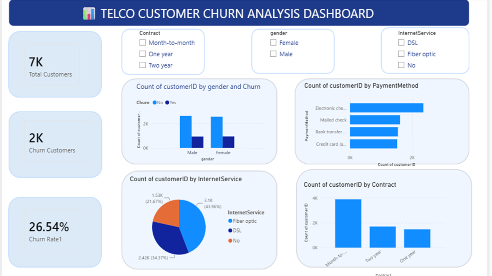

# 📊 Telco Customer Churn Analysis

## 📌 Project Overview

This project analyzes customer churn in a telecommunications company using Python, PostgreSQL, SQL, and Power BI. The objective is to identify customer behavior, understand churn patterns, and build an interactive dashboard for business decision-making.

---

## 🎯 Objectives

- Clean and preprocess raw customer data
- Perform Exploratory Data Analysis (EDA)
- Write SQL queries to analyze customer data
- Build an interactive Power BI dashboard
- Generate business insights from customer churn data

---

## 🛠️ Tools & Technologies

- Python (Pandas, NumPy, Matplotlib)
- Jupyter Notebook
- PostgreSQL
- SQL
- Power BI
- GitHub

---

## 📂 Project Workflow

1. Data Collection
2. Data Cleaning using Python
3. Exploratory Data Analysis (EDA)
4. SQL Analysis using PostgreSQL
5. Dashboard Development in Power BI
6. Business Insights

---

## 📊 Dashboard Features

- Total Customers
- Churn Customers
- Churn Rate
- Customers by Contract Type
- Customers by Internet Service
- Customers by Payment Method
- Churn by Gender
- Interactive Filters (Slicers)

---

## 📁 Project Files

```
Telco-Customer-Churn-Analysis
│
├── Dataset
│   └── Telco_Customer_Churn_Cleaned.csv
│
├── Jupyter Notebook
│   └── Telco_Customer_Churn_Analysis.ipynb
│
├── SQL
│   └── SQL_Queries.sql
│
├── Power BI
│   └── Telco_Customer_Churn_Dashboard.pbix
│
├── Images
│   └── Dashboard.png
│
└── README.md
```

---

## 📈 Key Insights

- Month-to-Month contract customers have the highest churn rate.
- Customers using Fiber Optic internet service show higher churn.
- Electronic Check is the most common payment method among churned customers.
- Long-term contracts have lower churn.

---

## 📷 Dashboard Preview

> Add your Power BI dashboard screenshot here.
> ## Dashboard Preview



---

## 👩‍💻 Author

**Mujahitha M**

Aspiring Data Analyst

---

## ⭐ If you like this project

Please give this repository a ⭐ on GitHub.
